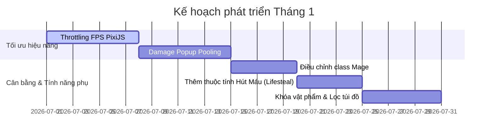

# Lộ Trình Phát Triển Game Chi Tiết (Detailed Game Development Roadmap)

Lộ trình này vạch ra danh sách các công việc cụ thể (Tasks), tệp cần sửa (Target Files), và thuật toán triển khai cho dự án **Idle RPG** trong vòng 4 tháng tới.

---

## 📅 THÁNG 1: TỐI ƯU HÓA HIỆU NĂNG, CÂN BẰNG HỆ THỐNG & QoL

Mục tiêu chính là tối ưu hóa CPU/GPU khi chạy auto treo máy lâu dài và cân bằng chỉ số giữa các class.



### 1. Tối Ưu Tần Suất Dựng Hình Trình Duyệt (FPS Throttling)
* **Mục tiêu:** Giảm mức tiêu thụ pin và tài nguyên phần cứng khi người chơi treo máy ở tab khác hoặc ẩn tab trình duyệt.
* **Tệp cần sửa:** [PixiGame.tsx](file:///e:/Code/IdleGame/apps/web/src/components/PixiGame.tsx)
* **Hướng dẫn chi tiết:**
  1. Đăng ký bộ lắng nghe sự kiện thay đổi trạng thái ẩn hiện của trang web:
     ```typescript
     useEffect(() => {
       const handleVisibilityChange = () => {
         if (document.hidden) {
           // Giảm FPS của Pixi ticker xuống còn 2 FPS khi ẩn tab
           app.ticker.maxFPS = 2;
         } else {
           // Khôi phục FPS tiêu chuẩn 60 FPS khi quay lại
           app.ticker.maxFPS = 60;
         }
       };
       document.addEventListener("visibilitychange", handleVisibilityChange);
       return () => document.removeEventListener("visibilitychange", handleVisibilityChange);
     }, [app]);
     ```

### 2. Tái Sử Dụng Hiệu Ứng Sát Thương (Damage Popups Object Pooling)
* **Mục tiêu:** Loại bỏ hoàn toàn hành vi khởi tạo/hủy phần tử DOM hoặc đối tượng Pixi Text liên tục gây ra rò rỉ bộ nhớ (Garbage Collection lag spikes).
* **Tệp cần sửa:** [PixiGame.tsx](file:///e:/Code/IdleGame/apps/web/src/components/PixiGame.tsx)
* **Hướng dẫn chi tiết:**
  1. Tạo lớp `DamagePopupPool` quản lý tối đa 50 đối tượng `PIXI.Text`.
  2. Khi nhân vật hoặc quái gây sát thương, lấy đối tượng rảnh từ Pool, gán vị trí $(x, y)$, nội dung hiển thị, hiệu ứng màu (Đỏ cho chí mạng, Trắng cho sát thương thường) và kích hoạt hiệu ứng bay lên rồi ẩn đi. Khi kết thúc hiệu ứng, đưa đối tượng trở lại trạng thái rảnh trong Pool thay vì hủy bỏ (`destroy`).

### 3. Điều Chỉnh Chỉ Số Cân Bằng Class Pháp Sư (Mage Class Balancing)
* **Mục tiêu:** Nâng cao khả năng sinh tồn của Pháp sư ở giai đoạn đầu game.
* **Tệp cần sửa:** [formulas.ts](file:///e:/Code/IdleGame/packages/shared/src/formulas.ts) và [mockDb.ts](file:///e:/Code/IdleGame/packages/firebase/src/mockDb.ts)
* **Hướng dẫn chi tiết:**
  1. Tại hàm `generateStarterSave` của class `mage`, tăng nhẹ chỉ số HP cơ bản từ 85 lên 100, tăng thủ cơ bản từ 3 lên 5.
  2. Tại hàm `recalculateHeroStats`, bổ sung chỉ số cộng thêm: nếu class là `mage`, tự động kích hoạt buff tăng 10% kháng hiệu ứng khống chế của quái vật phó bản.

### 4. Triển Khai Chỉ Số Hút Máu (Lifesteal Mechanics)
* **Mục tiêu:** Cho phép hồi lại máu khi nhân vật gây sát thương vật lý lên quái vật.
* **Tệp cần sửa:** [Engine.ts](file:///e:/Code/IdleGame/packages/engine/src/Engine.ts) và [formulas.ts](file:///e:/Code/IdleGame/packages/shared/src/formulas.ts)
* **Hướng dẫn chi tiết:**
  1. Trong vòng lặp combat của `Engine.ts`, sau khi tính toán sát thương thực tế gây ra cho quái vật:
     $$\text{Sát thương thực tế} = \max(1, \text{Sát thương gây ra} - \text{Giáp quái})$$
  2. Lấy chỉ số `hero.lifesteal` nhân với sát thương thực tế để tính toán lượng máu hồi lại:
     $$\text{HP Hồi phục} = \text{Round}(\text{Sát thương thực tế} \times \text{Lifesteal})$$
  3. Cộng lượng máu này vào `hero.currentHp` nhưng không vượt quá `hero.maxHp`.

---

## 📅 THÁNG 2: THÚ CƯNG ĐỒNG HÀNH, BẢNG BÁO CÁO NGOẠI TUYẾN & CỔ VẬT

Tập trung vào phát triển tính năng tương tác đồng hành và gia tăng tài nguyên thu được khi ngoại tuyến.

### 1. Hệ Thống Thú Cưng Đồng Hành (Companion System)
* **Tệp cần tạo mới:** `apps/web/src/components/tabs/PetTab.tsx`
* **Tệp cần sửa:** [game.ts](file:///e:/Code/IdleGame/packages/shared/src/types/game.ts) (Thêm kiểu dữ liệu `PetState` và danh sách Pet sở hữu), [gameStore.ts](file:///e:/Code/IdleGame/apps/web/src/stores/gameStore.ts) (Thêm hàm triệu hồi Pet bằng Kim Cương).
* **Hướng dẫn chi tiết:**
  1. Khai báo interface cho Pet:
     ```typescript
     export interface PetInstance {
       id: string;
       templateId: string;
       name: string;
       rarity: 'common' | 'uncommon' | 'rare' | 'epic' | 'legendary';
       level: number;
       exp: number;
       statBonus: Partial<BaseStats>;
     }
     ```
  2. Bổ sung Pet đồng hành vẽ trực tiếp trên màn hình Canvas PixiJS. Pet sẽ di chuyển bám đuổi theo nhân vật chính bằng thuật toán nội suy Lerp:
     $$x_{\text{pet}} = x_{\text{pet}} + (x_{\text{hero}} - x_{\text{pet}}) \times 0.1$$
     $$y_{\text{pet}} = y_{\text{pet}} + (y_{\text{hero}} - y_{\text{pet}}) \times 0.1$$

### 2. Thiết Kế Màn Hình Tổng Kết Ngoại Tuyến (Offline Gains Screen)
* **Tệp cần sửa:** [gameStore.ts](file:///e:/Code/IdleGame/apps/web/src/stores/gameStore.ts) (Tính toán thời gian chênh lệch khi đăng nhập)
* **Hướng dẫn chi tiết:**
  1. Khi người chơi đăng nhập, so sánh thời gian hiện tại với thời gian lưu trữ cuối cùng (`lastSavedTime`).
  2. Nếu thời gian chênh lệch $\Delta t \ge 5\text{ phút}$:
     * Số Vàng nhận được: $\text{Gold} = \Delta t_{\text{giây}} \times \text{Lượng vàng rơi trung bình của Ải hiện tại} \times 0.6$ (Giới hạn tối đa 12 giờ ngoại tuyến).
     * EXP nhận được: $\text{EXP} = \Delta t_{\text{giây}} \times \text{EXP trung bình của Ải} \times 0.6$.
     * Hiển thị Popup Modal `OfflineReportModal` tổng hợp số tiền, kinh nghiệm nhận được và số lượng trang bị tự động phân tách bằng màu sắc vàng/tím lấp lánh.

---

## 📅 THÁNG 3: BANG HỘI CHI TIẾT, ĐẤU TRƯỜNG PVP & PHÓ BẢN HỢP TÁC

Nâng cấp các tương tác mạng và phát triển tính năng nhiều người chơi cùng chiến đấu.

### 1. Kỹ Năng Bang Hội & Kho Bang Hội (Guild Buffs & Warehouse)
* **Tệp cần sửa:** [GuildTab.tsx](file:///e:/Code/IdleGame/apps/web/src/components/tabs/GuildTab.tsx)
* **Hướng dẫn chi tiết:**
  1. Thêm tab phụ "Kỹ Năng Bang" (Guild Skills) trong giao diện Bang hội.
  2. Sử dụng quỹ tài nguyên cống hiến đóng góp chung của các thành viên để thăng cấp các nút kỹ năng: *Vanguard Strength (Tăng Công cả Bang), Iron Bulwark (Tăng Thủ cả Bang)*.
  3. Cập nhật hàm `recalculateHeroStats` trong formulas để cộng thêm chỉ số tương ứng từ cấp độ nâng cấp của bang hội đang tham gia.

### 2. Thiết Kế Đấu Trường PVP Xếp Hạng (Asynchronous PVP Arena)
* **Tệp cần tạo mới:** `apps/web/src/components/tabs/ArenaTab.tsx`
* **Tệp cần sửa:** [client.ts](file:///e:/Code/IdleGame/packages/firebase/src/client.ts) (Tải danh sách các đối thủ xung quanh thứ hạng)
* **Hướng dẫn chi tiết:**
  1. Tải về thông tin 3 người chơi có thứ hạng gần kề với người chơi từ Realtime Database.
  2. Khi bắt đầu chiến đấu, hệ thống khởi chạy công thức so tài mô phỏng tự động giữa chỉ số thực tế của bạn và đối thủ. Sau mỗi trận đấu thắng sẽ được cộng điểm Rank, thua bị trừ điểm Rank.

---

## 📅 THÁNG 4: NỘI DUNG CUỐI GAME (ENDGAME EXPANSION) & CÂY THIÊN PHÚ

Thiết lập hệ thống giữ chân người chơi có cấp độ cao bằng các nội dung khiêu chiến vô hạn.

### 1. Cây Kỹ Năng Trùng Sinh Phân Nhánh (Prestige Talent Tree)
* **Tệp cần tạo mới:** `apps/web/src/components/PrestigeTalentTree.tsx`
* **Tệp cần sửa:** [formulas.ts](file:///e:/Code/IdleGame/packages/shared/src/formulas.ts) (Tính toán chỉ số từ cây tài năng)
* **Hướng dẫn chi tiết:**
  1. Thiết kế cây thiên phú chia làm 3 hướng:
     - **Tấn công (Offense Branch):** Tăng % Tấn công, sát thương chí mạng, hồi chiêu kỹ năng nhanh.
     - **Phòng thủ (Defense Branch):** Tăng % Máu, giáp, tỉ lệ đỡ đòn, phản sát thương nhận vào.
     - **Thu thập (Utility Branch):** Tăng % Vàng rơi ra, kinh nghiệm nhận được và tăng độ thuần khiết của trang bị rơi ra.
  2. Điểm Trùng Sinh nhận được sau mỗi lần Trùng Sinh được dùng để mở khóa các nhánh này.

### 2. Chế Độ Vượt Tháp Hư Không Vô Hạn (Void Tower Challenge)
* **Tệp cần sửa:** [DungeonTab.tsx](file:///e:/Code/IdleGame/apps/web/src/components/tabs/DungeonTab.tsx)
* **Hướng dẫn chi tiết:**
  1. Thêm cổng khiêu chiến "Tháp Hư Không".
  2. Mỗi tầng tháp sẽ nâng chỉ số quái lên thêm 20%, đồng thời áp đặt các bùa hại ngẫu nhiên lên người chơi (Ví dụ: Giảm 50% khả năng hồi máu, hoặc mất hoàn toàn tỉ lệ chí mạng).
  3. Người chơi leo tháp càng cao càng nhận được nhiều Aether Crystals cao cấp dùng để cường hóa trang bị vượt mốc giới hạn.

---

## 🛠️ CHI TIẾT LỘ TRÌNH CÔNG NGHỆ (TECHNICAL ARCHITECTURE TASKLIST)

Để hỗ trợ lộ trình phát triển trên, cơ sở hạ tầng mạng cần được nâng cấp qua các bước cụ thể:

1. **Giao dịch Firebase chống trùng lặp (Anti-duplication Transactions):**
   * Thay thế các câu lệnh `set` hoặc `update` số dư đơn giản bằng phương thức `runTransaction` tại [client.ts](file:///e:/Code/IdleGame/packages/firebase/src/client.ts) khi thực hiện giao dịch mua bán vật phẩm, tránh việc người chơi cố ý ngắt mạng để nhân bản tài nguyên (dupe gold/diamonds).
2. **Nén dữ liệu lưu trữ (Save Compression):**
   * Sử dụng thư viện nén nhẹ như `lz-string` để mã hóa và nén chuỗi JSON save game trước khi đẩy lên Firebase Database. Điều này giảm thiểu dung lượng băng thông sử dụng và tăng tốc độ lưu game lên tới 400%.
3. **Mã hóa và xác thực dữ liệu phía Server (Firebase Functions Validation):**
   * Triển khai bộ xác thực chỉ số lực chiến CP ở phía Server để phát hiện và tự động khóa (ban) các tài khoản cố tình can thiệp chỉnh sửa tệp tin LocalStorage/RAM chỉ số công thủ nhằm phá hoại bảng xếp hạng PVP Arena.
