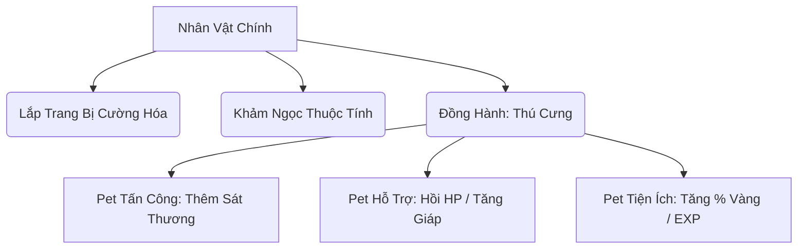

# Lộ Trình Phát Triển Game Chi Tiết (Detailed Game Development Roadmap)

Lộ trình này vạch ra các định hướng thiết kế và phát triển kỹ thuật cho dự án **Idle RPG** trong vòng 4 tháng tới, giúp tối ưu hóa hiệu năng, cải thiện trải nghiệm người chơi (UX), và mở rộng quy mô tính năng (Endgame Content).

---

## 📅 THÁNG 1: TỐI ƯU HÓA HỆ THỐNG, CÂN BẰNG & TRẢI NGHIỆM CHƠI (QoL)

Trọng tâm tháng đầu tiên là cải tiến hiệu năng render, hoàn thiện các tính năng cốt lõi đang có và cân bằng chỉ số giữa các phân lớp nhân vật.

### 1. Nâng Cấp Hệ Thống Chiến Đấu & Render
* **Vòng lặp PixiJS:** Tối ưu hóa chu kỳ render của PixiJS trong [PixiGame.tsx](file:///e:/Code/IdleGame/apps/web/src/components/PixiGame.tsx). Tự động tắt/giảm tần suất dựng hình (FPS throttling) khi tab trình duyệt bị ẩn hoặc người chơi chuyển sang tab khác (ví dụ: mở Hòm đồ, Cửa hàng) để giảm tải CPU/GPU.
* **Bộ đệm sát thương hiển thị (Damage Popups Pooling):** Triển khai đối tượng tái sử dụng (Object Pool) cho các hiệu ứng chữ số nhảy sát thương crít, né tránh trên màn hình Canvas nhằm triệt tiêu hiện tượng giật lag khi tốc độ đánh của nhân vật tăng cao.

### 2. Tinh Chỉnh Cân Bằng Chỉ Số (Class Balancing)
* **Chỉ số Pháp Sư (Mage):** Điều chỉnh chỉ số phòng thủ và tỉ lệ né tránh để cân bằng lại độ sinh tồn cực thấp trong các ải Boss phó bản khó.
* **Cơ chế Hút Máu (Life Steal):** Thêm thuộc tính Hút máu (chỉ số phần trăm hồi máu dựa trên sát thương gây ra) vào trang bị nhẫn/vũ khí để tạo thêm sự phong phú khi build trang bị.

### 3. Tối Ưu Hóa Trải Nghiệm Hòm Đồ (UX Bag Tab)
* **Khóa trang bị (Item Lock):** Thêm tính năng bấm khóa trang bị trong [BagTab.tsx](file:///e:/Code/IdleGame/apps/web/src/components/tabs/BagTab.tsx) để bảo vệ các món đồ quý hiếm khỏi việc vô tình bị phân tách hàng loạt.
* **Bộ lọc nâng cao (Advanced Filters):** Hỗ trợ lọc trang bị theo chỉ số chính (Ví dụ: Tìm vũ khí có dòng % Công cao nhất) và phân loại cấp độ cường hóa.

---

## 📅 THÁNG 2: HỆ THỐNG THÚ CƯNG, HOẠT ẢNH NGOẠI TUYẾN & THẦN KHÍ PHỤC CỔ

Mở rộng chiều sâu chiến thuật bằng cách đưa vào hệ sinh thái đồng hành và cơ chế lưu trữ ngoại tuyến trực quan.



### 1. Hệ Thống Thú Cưng Đồng Hành (Companion/Pet System)
* **Gacha Pet & Tiến Hóa:** Mở tab triệu hồi Thú Cưng trong Shop, tiêu tốn Kim Cương để nhận Pet từ phẩm chất Thường đến Huyền thoại.
* **Kỹ năng bổ trợ của Pet:** Pet đi theo nhân vật trên màn hình chiến đấu Canvas, tự động tấn công hỗ trợ hoặc kích hoạt kỹ năng đặc biệt (ví dụ: Cứ mỗi 10 giây hồi 5% HP, hoặc tăng 15% Tốc độ di chuyển/đánh).

### 2. Bảng Tổng Kết Tài Nguyên Ngoại Tuyến (Offline Gains Screen)
* **Báo cáo trực quan (Visual Report Modal):** Khi người chơi mở game sau một khoảng thời gian ngoại tuyến, hệ thống sẽ hiển thị một Popup tổng kết vô cùng bắt mắt:
  * Tổng thời gian treo máy ngoại tuyến (Ví dụ: `08 giờ 45 phút`).
  * Tổng lượng Vàng và EXP tích lũy được (có hiệu ứng chạy số tăng dần).
  * Danh sách các trang bị quý hiếm nhặt được, kèm theo thống kê số lượng trang bị rác đã tự động phân tách thành Aether Shards.

### 3. Ô Trang Bị Thần Khí Đặc Biệt (Artifact Artifact Slots)
* Thêm 2 ô trang bị mới: **Cổ Vật (Relic)** và **Pháp Bảo (Artifact)**. Các vật phẩm này không thể rèn thông thường mà chỉ có thể săn được ở phó bản Khó hoặc rớt ngẫu nhiên từ Boss thế giới với các dòng chỉ số độc nhất vô nhị (Ví dụ: "Tăng 20% sát thương lên quái hệ Ám").

---

## 📅 THÁNG 3: BANG HỘI TOÀN DIỆN, ĐẤU TRƯỜNG PVP & KHÔNG GIAN HỢP TÁC

Đưa game từ trải nghiệm chơi đơn thuần túy sang môi trường tương tác xã hội nhiều người chơi.

### 1. Mở Rộng Tính Năng Bang Hội (Guild Expansion)
* **Kỹ năng Bang Hội (Guild Skills):** Điểm cống hiến đóng góp của thành viên sẽ được Bang chủ dùng để mở khóa các Buff thụ động dùng chung cho toàn bộ thành viên trong bang (Ví dụ: +5% Sát thương Boss, +10% Vàng nhận được).
* **Kho Bang Hội (Guild Warehouse):** Nơi các thành viên có thể quyên góp trang bị dư thừa của mình và dùng điểm cống hiến để đổi lấy các trang bị do người khác quyên góp.

### 2. Đấu Trường PVP Xếp Hạng (PVP Arena System)
* **Đấu trường bất đối xứng (Asynchronous PVP):** Người chơi sắp xếp đội hình phím tắt và chỉ số để thách đấu với bóng dữ liệu (Shadow Data) của người chơi khác. Trận đấu diễn ra hoàn toàn tự động dựa trên chỉ số thực tế của hai bên.
* **Bảng xếp hạng mùa giải (Season Leaderboards):** Nhận danh hiệu độc quyền và phần thưởng Kim cương hàng tuần dựa trên thứ hạng rank (Đồng, Bạc, Vàng, Bạch Kim, Kim Cương, Thách Đấu).

### 3. Phó Bản Hợp Tác Liên Quân (Cooperative Multi-dungeons)
* Cho phép 2-3 người chơi lập tổ đội thời gian thực để cùng khiêu chiến các phó bản cực khó, yêu cầu sự kết hợp giữa các lớp nhân vật (Ví dụ: Hiệp Sĩ thu hút sát thương của Boss, Pháp Sư và Sát Thủ đứng sau gây sát thương tối đa).

---

## 📅 THÁNG 4: NỘI DUNG CUỐI GAME (ENDGAME) & CÂY THIÊN PHÚ TRÙNG SINH

Giai đoạn giữ chân người chơi lâu dài bằng các thử thách vô hạn và hệ thống phát triển kỹ năng phân nhánh cực sâu.

```
[Trùng Sinh Cấp 1] ──> Mở khóa Cây Thiên Phú (Prestige Tree)
                           ├── Phân nhánh Cuồng Chiến (Tập trung Tấn công, Chí mạng)
                           ├── Phân nhánh Bất Tử (Tập trung Máu, Hồi phục, Kháng chí mạng)
                           └── Phân nhánh Thợ Săn (Tập trung Tốc độ đánh, Vàng, EXP)
```

### 1. Cây Tài Năng Trùng Sinh Phân Nhánh (Prestige Talent Tree)
* Thay thế hệ thống cộng chỉ số trùng sinh đơn giản hiện tại bằng một Cây Tài Năng (Talent Tree) đồ sộ:
  * Điểm Trùng Sinh dùng để nâng cấp các nút kỹ năng đặc biệt (Ví dụ: "Đòn đánh thường có 10% cơ hội kích hoạt chuỗi sét lan gây 150% sát thương phép").
  * Người chơi có thể reset cây tài năng miễn phí hoặc tiêu tốn lượng nhỏ kim cương để thay đổi lối chơi.

### 2. Thử Thách Tháp Vô Hạn (Infinity Void Tower)
* Chế độ leo tháp không giới hạn số tầng. Mỗi tầng có các bùa hại (Debuffs) ngẫu nhiên thử thách người chơi (Ví dụ: Tầng 50: Giảm 30% tốc độ đánh của nhân vật; Tầng 60: Boss hồi phục 2% HP mỗi giây).
* Cung cấp phần thưởng nguyên liệu quý hiếm để nâng cấp Thần Khí Aether ở các cấp bậc huyền thoại tối thượng.

### 3. Boss Thế Giới (Global World Boss Event)
* Hoạt động định kỳ hàng ngày, toàn bộ người chơi trên máy chủ sẽ cùng nhau tấn công một siêu Boss khổng lồ có lượng máu vô hạn trong vòng 15 phút.
* Xếp hạng và trao thưởng rương trang bị thần thoại dựa trên tổng lượng sát thương (DPS) mà người chơi đóng góp.

---

## 🛠️ LỘ TRÌNH PHÁT TRIỂN CÔNG NGHỆ (TECHNICAL ARCHITECTURE ROADMAP)

Để đáp ứng các tính năng trên, nền tảng hệ thống cần được nâng cấp tương ứng:

1. **Chuyển đổi lưu trữ sang Realtime Database Transactions:** Sử dụng lệnh `runTransaction` của Firebase khi cộng/trừ tiền tệ (vàng, kim cương) để triệt tiêu hoàn toàn lỗi bất đồng bộ số dư hoặc gian lận dữ liệu do mất kết nối mạng đột ngột.
2. **Cơ chế nén dữ liệu lưu trữ (Save Compression):** Nén dữ liệu save game bằng thuật toán nhẹ trước khi lưu lên Database nhằm tiết kiệm dung lượng truyền tải mạng và tối ưu chi phí hạ tầng Firebase.
3. **Mã hóa kết nối WebSocket:** Bảo vệ luồng thông tin kết nối đa người chơi thời gian thực của Đấu trường và Phó bản Co-op, phòng chống mã độc can thiệp chỉnh sửa chỉ số nhân vật ở phía Client.
